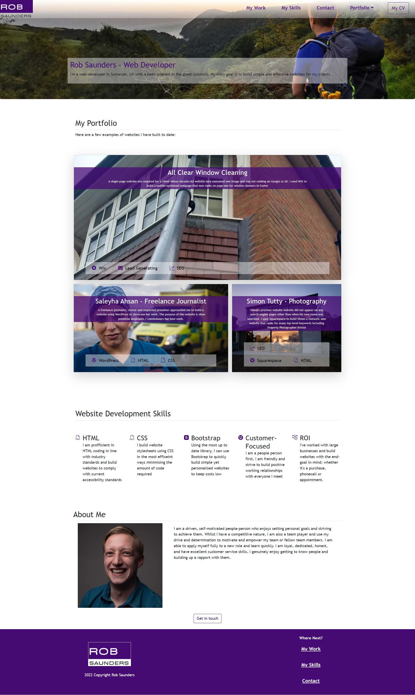

# Bootstrap-Portfolio

## Description
This is my portfolio, but this time built using Custom styled Bootstrap. It isn't exactly the same because although I started to style it to be an exact replica, I realised that this defeats the object and made it take longer. The process was sped up after this realisation. Using bootstrap, the website contains the following items:

* A navigation menu at the top with relevant working links
* A hero section using a jumbotron
* A work section using Bootstrap cards displaying my work in a grid with a breif description
* A skills section showing my development skills
* An about section with contact details
* A footer with hyperlinks. All hyperlinks must have a hover-effect and display a box-shadow on hover

There should be minimal use of media queries and the website must be deployed to GitHub pages with a regualar commit history

##Usage

The live applicaton can be viewed here: https://r0bsaunders.github.io/Bootstrap-Portfolio/

The GitHub repository can be found here: https://github.com/R0bsaunders/Bootstrap-Portfolio/

Here is a screenshot of the portfolio: 

## Credits

Screendhot - © 2022 edX Boot Camps LLC. Confidential and Proprietary. All Rights Reserved.

## License

There is no license - However, my contact details may not be used for sales or marketing, and may not be sold or provided to anyone without my express consent. My contact detials may be used only for the purpose of demonstrating the code I have learnt and for potential job / work opportunities. No recruiters please.